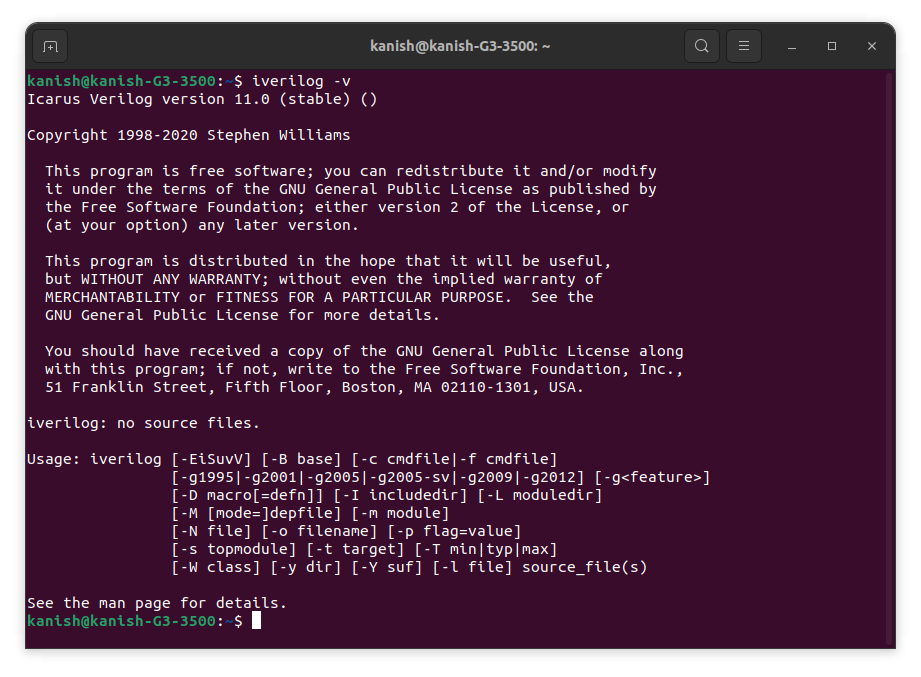
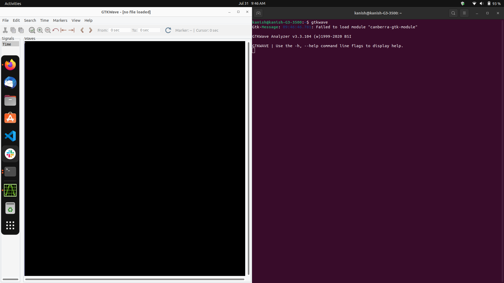
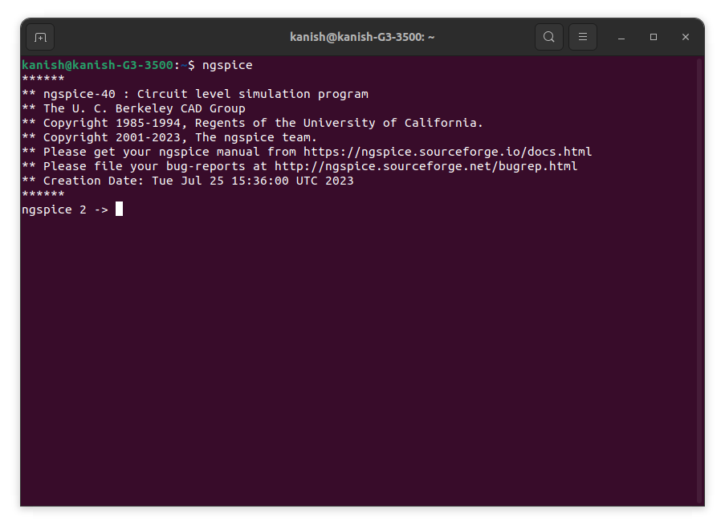
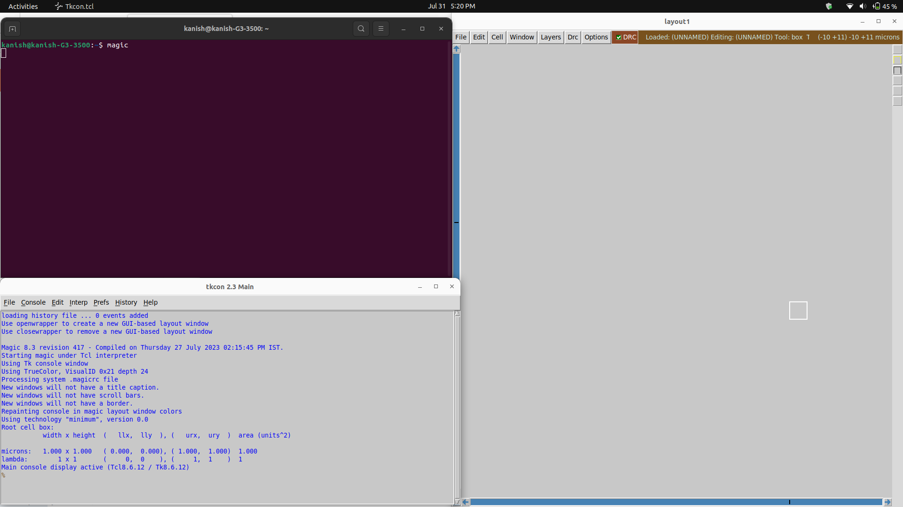

# IIITB_Physical_Design_Using_ASIC_Class

## Table of Contents
- [Week - 1](#week---1)
    * [Day - 1 : Software Installation](#day---1-software-installation)
- [References](#references)

## Week - 1 
## Day - 1 :Software Installation

[Yosys Section]:#
### **YOSYS**
Yosys is a framework for Verilog RTL synthesis. It currently has extensive Verilog-2005 support and provides a basic set of synthesis algorithms for various application domains. Selected features and typical applications:

   1. Process almost any synthesizable Verilog-2005 design
   2. Converting Verilog to BLIF / EDIF/ BTOR / SMT-LIB / simple RTL Verilog / etc.
   3. Built-in formal methods for checking properties and equivalence
   4. Mapping to ASIC standard cell libraries (in Liberty File Format)
   5. Mapping to Xilinx 7-Series and Lattice iCE40 and ECP5 FPGAs
   6. Foundation and/or front-end for custom flows 

Yosys can be adapted to perform any synthesis job by combining the existing passes (algorithms) using synthesis scripts and adding additional passes as needed by extending the Yosys C++ code base. Yosys also serves as backend for several tools that use formal methods to reason about designs, such as sby for SMT-solver-based formal property checking or mcy for evaluating the quality of testbenches with mutation coverage metrics.
Yosys is free software licensed under the ISC license (a GPL compatible license that is similar in terms to the MIT license or the 2-clause BSD license). 

**Steps to install Yosys**

```
git clone https://github.com/YosysHQ/yosys.git
cd yosys 
sudo apt install make (If make is not installed please install it) 
sudo apt-get install build-essential clang bison flex \
    libreadline-dev gawk tcl-dev libffi-dev git \
    graphviz xdot pkg-config python3 libboost-system-dev \
    libboost-python-dev libboost-filesystem-dev zlib1g-dev
make config-gcc
make 
sudo make install
```
    


[Icarus Verilog Section]:#
### **ICARUS VERILOG**
Icarus Verilog is an implementation of the Verilog hardware description language compiler that generates netlists in the desired format (EDIF). It supports the 1995, 2001 and 2005 versions of the standard, portions of SystemVerilog, and some extensions.Icarus Verilog is released under the GNU General Public License, Icarus Verilog is free software. Icarus is composed of a Verilog compiler (including a Verilog preprocessor) with support for plug-in backends, and a virtual machine that simulates the design.

**Steps to install Icarus Verilog**
```
sudo apt-get install iverilog
```



[GTKWave Section]:#
### **GTKWAVE**
GTKWave is a fully featured GTK+ based wave viewer for Unix and Win32 which reads LXT, LXT2, VZT, FST, and GHW files as well as standard Verilog VCD/EVCD files and allows their viewing.

**Steps to install GTKKwave**
```
sudo apt install gtkwave
```



[Ngspice Section]:#
### **NGSPICE**
ngspice is the open source spice simulator for electric and electronic circuits comprising of JFETs, bipolar and MOS transistors, passive elements like R, L, or C, diodes, transmission lines and other devices, all interconnected in a netlist. Digital circuits are simulated as well, event driven and fast, from single gates to complex circuits. And you may enter the combination of both analog and digital as a mixed-signal circuit. ngspice offers a wealth of device models for active, passive, analog, and digital elements. Model parameters are provided by our collections, by the semiconductor device manufacturers, or from semiconductor foundries. The user can add their circuits as a netlist, and the output is one or more graphs of currents, voltages and other electrical quantities or is saved in a data file.

**Steps to install ngspice**</br>
Download the tarball from ***https://sourceforge.net/projects/ngspice/files/*** to a local directory and then follow the commands given below :
```
tar -zxvf ngspice-37.tar.gz
cd ngspice-40
mkdir release
cd release
../configure  --with-x --with-readline=yes --disable-debug
make
sudo make install

```



[OpenSTA Section]: #
### **OPENSTA**
OpenSTA is a gate level static timing verifier. As a stand-alone executable it can be used to verify the timing of a design using standard file formats such as Verilog netlist, Liberty library, SDC timing constraints, SDF delay annotation and SPEF parasitics. OpenSTA uses a TCL command interpreter to read the design, specify timing constraints and print timing reports.

**Steps to install OpenSTA**</br>
Prior to the installation of the OpenSTA install the dependencies using the command shown below :</br>
``` 
sudo apt-get install cmake clang gcc tcl swig bison flex 
```

After installing the dependencies use the following command to install OpenSTA:
```
git clone https://github.com/The-OpenROAD-Project/OpenSTA.git
cd OpenSTA
mkdir build
cd build
cmake ..
make
sudo make install
```


[Magic Section]:#
### **MAGIC**
Magic is an electronic design automation (EDA) layout tool for very-large-scale integration (VLSI) integrated circuit (IC) originally written by John Ousterhout and his graduate students at UC Berkeley. Work began on the project in February 1983. The main difference between Magic and other VLSI design tools is its use of "corner-stitched" geometry, in which all layout is represented as a stack of planes, and each plane consists entirely of "tiles" (rectangles). Magic is primarily famous for writing the scripting interpreter language Tcl.

**Steps to install magic**</br>
```
sudo apt-get install m4
sudo apt-get install tcsh
sudo apt-get install csh
sudo apt-get install libx11-dev
sudo apt-get install tcl-dev tk-dev
sudo apt-get install libcairo2-dev
sudo apt-get install mesa-common-dev libglu1-mesa-dev
sudo apt-get install libncurses-dev
git clone https://github.com/RTimothyEdwards/magic
cd magic
./configure
make
sudo make install
```



[OpenLane Section]:#
### **OPENLANE**
OpenLane is an automated RTL to GDSII flow based on several components including OpenROAD, Yosys, Magic, Netgen, CVC, SPEF-Extractor, KLayout and a number of custom scripts for design exploration and optimization. It also provides a number of custom scripts for design exploration and optimization. The flow performs all ASIC implementation steps from RTL all the way down to GDSII. Currently, it supports both A and B variants of the sky130 PDK, the C variant of the gf180mcu PDK, and instructions to add support for other (including proprietary) PDKs are documented. OpenLane abstracts the underlying open source utilities, and allows users to configure all their behavior with just a single configuration file.

Prior to the installation of the OpenLane install the dependencies and packages using the command shown below :</br>
``` 
sudo apt-get update
sudo apt-get upgrade
sudo apt install -y build-essential python3 python3-venv python3-pip make git
```
Docker Installation :</br>
```
sudo apt install apt-transport-https ca-certificates curl software-properties-common
curl -fsSL https://download.docker.com/linux/ubuntu/gpg | sudo gpg --dearmor -o /usr/share/keyrings/docker-archive-keyring.gpg

echo "deb [arch=amd64 signed-by=/usr/share/keyrings/docker-archive-keyring.gpg] https://download.docker.com/linux/ubuntu $(lsb_release -cs) stable" | sudo tee /etc/apt/sources.list.d/docker.list > /dev/null

sudo apt update
sudo apt install docker-ce docker-ce-cli containerd.io
sudo docker run hello-world

sudo groupadd docker
sudo usermod -aG docker $USER
sudo reboot 


# Check for installation
sudo docker run hello-world
```

**Steps to install OpenLane, PDKs and Tools**</br>
```
cd $HOME
git clone https://github.com/The-OpenROAD-Project/OpenLane
cd OpenLane
make
make test
```


[Reference Section]:#
## References
1. https://yosyshq.net/yosys/
2. https://steveicarus.github.io/iverilog/
3. https://gtkwave.sourceforge.net/
4. https://ngspice.sourceforge.io/
5. https://github.com/The-OpenROAD-Project/OpenSTA
6. http://opencircuitdesign.com/magic/
7. https://github.com/The-OpenROAD-Project/OpenLane